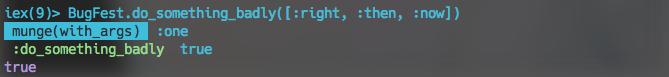

# Probe

Tired of the output from 10,000 `IO.inspect` statements cluttering your terminal?

Power you debugging with Probe!

```elixir

defmodule BugFest do
  require Probe#, as: P

  def do_something_badly(with_args) do
    case with_args |> munge() |> Probe.i do
      :one -> true
      :two -> false
    end |> Probe.green(:do_something_badly)
  end

  def munge(args) when is_list(args) do
    :one
  end
  def munge(args) do
    :two
  end
end

BugFest.do_something_badly([:right, :then, :now])
 munge(with_args)  :one
 :do_something_bady  true
:one

```

All of the convenience of `IO.inspect` with none of the confusion.

Plus, **colours**.



## Disabling in Production

If you carry the shame of your debugging into production then you can at least
reduce the impact of your incompetence by disabling Probe completely.

Just add

```elixir
config :probe, disabled: true
```

into `config/prod.exs` to not only disable the logging output but also (since
Probe uses macros) completely remove the debugging code from your apps. (You
may need to provoke a re-compilation of your app to see the change appear.)

## Installation

If [available in Hex](https://hex.pm/docs/publish), the package can be
installed by adding `probe` to your list of dependencies in `mix.exs`:

```elixir
def deps do
  [{:probe, "~> 1.0.0"}]
end
```

Documentation can be generated with [ExDoc](https://github.com/elixir-lang/ex_doc)
and published on [HexDocs](https://hexdocs.pm). Once published, the docs can
be found at [https://hexdocs.pm/probe](https://hexdocs.pm/probe).

